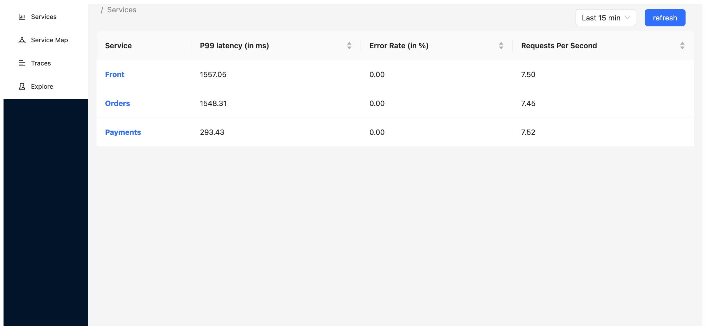
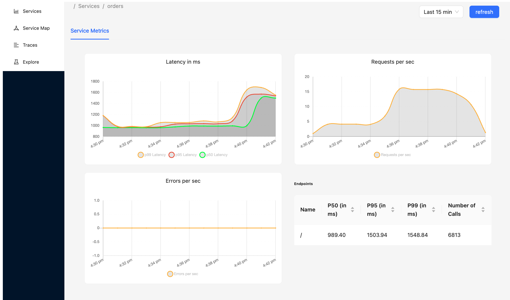
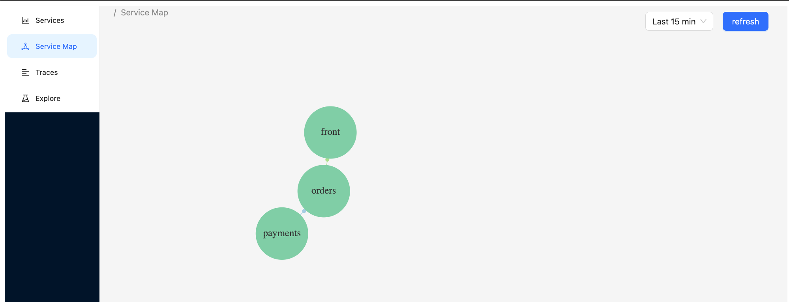
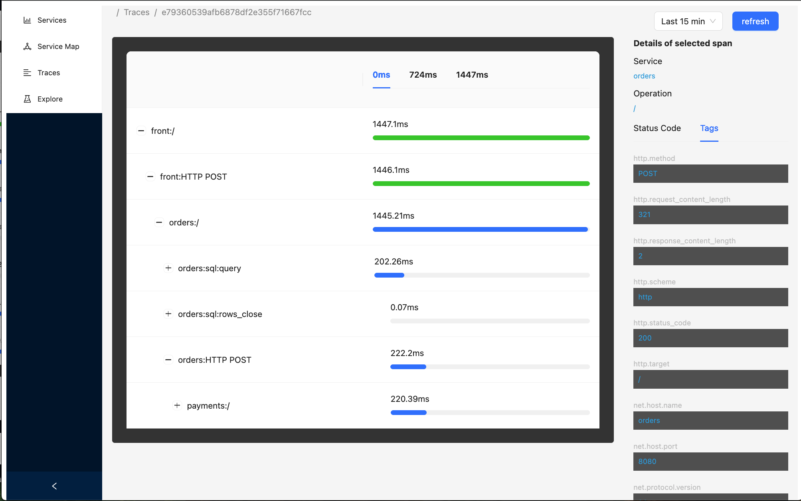

# observability

An opensource observability platform. (But really just an excuse for me to learn a lot about observability and otel.)

## Getting Started

```
docker compose up --build
```

## Frontend Snaps











